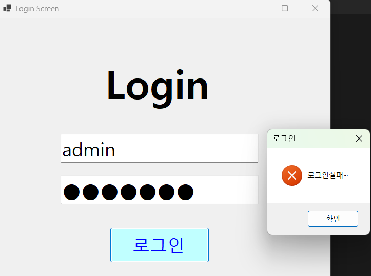
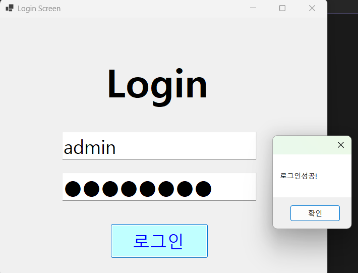
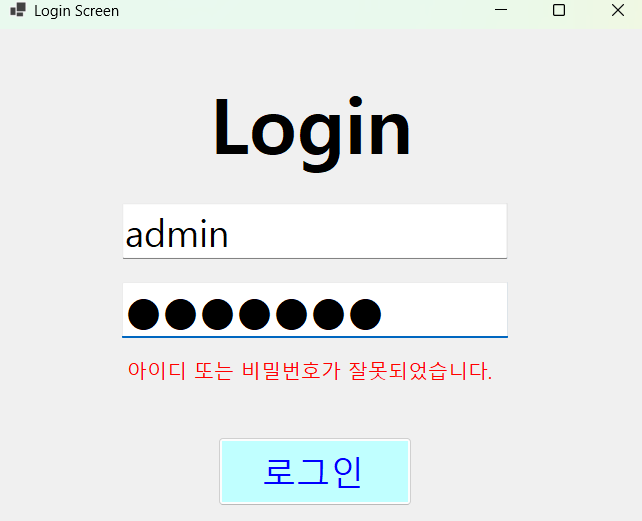

\# (C# 코딩) 로그인화면

\## 개요

\-C# 프로그래밍학습

\-1줄소개: 아이디와 비밀번호를 입력하여 로그인하는 로그인화면

\-사용한플랫폼: -C#, .NET Windows Forms, Visual Studio, GitHub

\-사용한컨트롤:label, textbox, button

\-구현한기능

placeholder로 입력창 안내하는 기능 구현

아이디와 패스워드입력하였을 시 성공, 실패 여부 확인

\## 실행화면(과제1)

\-과제1코드의실행스크린샷

  

 

\-과제내용

1.컨트롤배치와기본적인속성설정

2.Placeholder로입력창안내하는기능구현

3.아이디와패스워드처리기능구현

\-구현내용과기능설명

1.UI 구성▶TextBox(아이디, 패스워드), Button(로그인) 등을적절히배치합니다.

2.Placeholder표시▶아이디와패스워드입력힌트를회색으로표시

3.로그인가능여부체크기능▶아이디와패스워드가모두맞아야로그인허용

4.로그인성공/실패메시지박스보여주기▶적절한메시지박스사용

\## 실행화면(과제2)

\-과제2코드의실행스크린샷

\-과제내용   
아이디 또는 패스워드가 잘못 입력되었을때 에러메시지 보여주기  
MessageBox를 띄우지말고 아이디와 패스워드를 입력하는 곳에 보여주기  
로그인 실패했을 시 메세지 박스 대신에 패스워드 창 밑에 현재 아이디 또는 패스워드가 입력되지않았다는 것을 알려주는 텍스트박스가 뜨게됨

\-구현내용과기능설명  
Label 컨트롤 추가  
Visible 속성을이용해서메시지보이기와숨기기기능구현  
visible에 true, false를 통해서 메세지를 보이고 숨기기가 가능하게 함  

\## 실행화면(과제3)

\-과제3코드의실행스크린샷

!\[과제3 실행화면](img/.png)

\-과제내용

\-구현내용과기능설명

&#x20; 

\## 실행화면(과제4)

\-과제4코드의실행스크린샷

\-과제내용

&#x20;

\-구현내용과기능설명

&#x20;  

